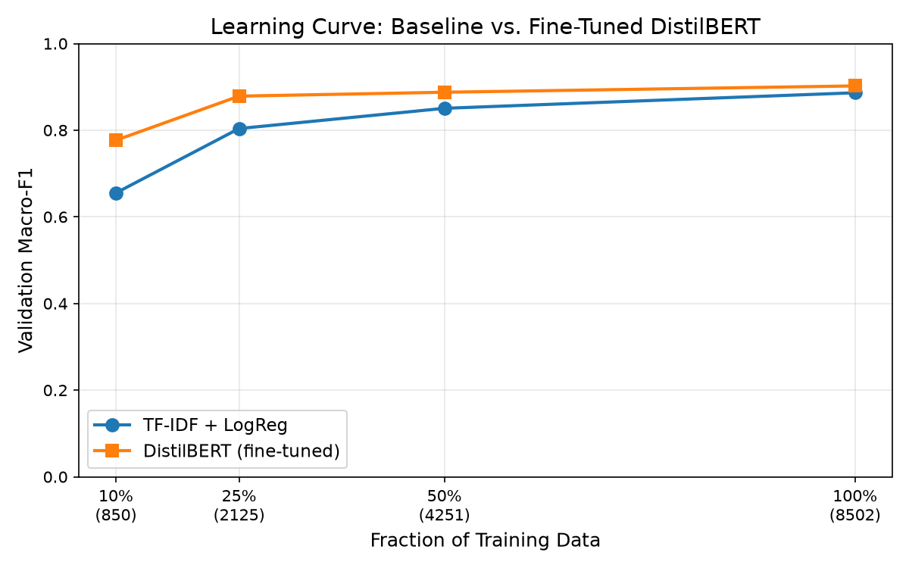

# Intent Classification: Baseline vs. Fine-Tuned Transformer

Comparing a TF-IDF + Logistic Regression baseline against a fine-tuned DistilBERT on the [Banking77](https://huggingface.co/datasets/PolyAI/banking77) intent classification dataset (77 intents, ~13K examples).

## Problem

Given a customer banking query (e.g., *"I need to top up my account"*), classify it into one of 77 intent categories. This project asks: **how much does fine-tuning a small transformer improve over a simple, strong baseline — and where does each fail?**

## Dataset

**Banking77** — 10,003 training + 3,080 test customer-support queries across 77 banking intents.

- Training set is split 85/15 into train/validation (stratified).
- Test set is held out and evaluated only once at the end.

## Methods

| Model | Description |
|-------|-------------|
| **Baseline** | TF-IDF (word n-grams, sublinear TF) → Logistic Regression. Hyperparameters (C, n-gram range) tuned on validation; best: C=10, unigrams. |
| **DistilBERT** | `distilbert-base-uncased` fine-tuned with AdamW + linear warmup. Hand-written PyTorch training loop. Evaluated with 3 random seeds. |

## Results

| Model | Test Accuracy | Test Macro-F1 |
|-------|:---:|:---:|
| TF-IDF + LogReg (C=10, unigrams) | 89.61% | 89.63% |
| DistilBERT (mean ± std, 3 seeds) | 90.15 ± 0.25% | 90.02 ± 0.30% |

The two models perform comparably (the 0.39-point gap falls within the transformer's seed-to-seed standard deviation of 0.30). TF-IDF + Logistic Regression is a genuinely strong baseline for this task.

### Learning Curve



Both models are trained on 10%, 25%, 50%, and 100% of the training data. To ensure a fair comparison, DistilBERT epochs are scaled at each fraction so the total number of gradient steps matches the full-data run (5 epochs x 266 batches = 1,330 steps).

| Data Fraction | Baseline Val F1 | DistilBERT Val F1 | DistilBERT Epochs |
|:---:|:---:|:---:|:---:|
| 10% (850) | 65.5% | 77.7% | 49 |
| 25% (2,125) | 80.4% | 87.9% | 20 |
| 50% (4,251) | 85.1% | 88.8% | 10 |
| 100% (8,502) | 88.6% | 90.2% | 5 |

DistilBERT outperforms the baseline at every data size. The transformer's advantage is largest in the low-data regime (10-25%), where pre-trained representations compensate for fewer examples. The gap narrows as data grows and the baseline catches up.

### Error Analysis

Error analysis uses the transformer's seed-456 run (test accuracy 89.81%, slightly below the 3-seed mean). Out of 3,080 test examples:
- **2,631** both models got right
- **185** both models got wrong (genuinely hard examples)
- **135** only the baseline got wrong (transformer improvement)
- **129** only the transformer got wrong (transformer regression)

The transformer's net improvement over the baseline is just **6 examples** — they make different mistakes on different intents, but at roughly the same rate. The errors both models share tend to involve overlapping intents (e.g., `card_not_working` vs. `card_acceptance`) and very short, ambiguous queries.

## Reproducibility

- **Baseline seed:** 42 (for splits and logistic regression).
- **Transformer seeds:** 42, 123, 456 (3 runs, mean ± std reported).
- All library versions pinned in `requirements.txt`.

## How to Run

### Prerequisites

- Python 3.9+
- GPU recommended for fine-tuning (free Google Colab or Kaggle works). CPU is fine for the baseline.

### Setup

```bash
git clone <repo-url>
cd intent-classification
python -m venv venv
source venv/bin/activate   # On Windows: venv\Scripts\activate
pip install -r requirements.txt
```

### Step-by-step

```bash
# 1. Explore the dataset — prints class counts, query lengths, sample examples
python src/data.py

# 2. Run the baseline — sweeps hyperparameters, evaluates on test
python src/baseline.py

# 3. Fine-tune DistilBERT — trains 3 seeds, evaluates on test
python src/finetune.py

# 4. Error analysis + learning curve — needs both models' predictions
python src/analyze.py
```

All results (metrics, plots, CSVs) are saved to the `results/` directory.

### Custom options

```bash
# Fine-tune with different settings
python src/finetune.py --epochs 3 --lr 2e-5 --batch_size 16

# Use different seeds
python src/finetune.py --seeds 1 2 3
```

## Project Structure

```
intent-classification/
├── README.md              # This file
├── requirements.txt       # Pinned dependencies
├── .gitignore             # Excludes checkpoints, caches, secrets
├── src/
│   ├── data.py            # Load Banking77, create train/val/test splits
│   ├── baseline.py        # TF-IDF + Logistic Regression baseline
│   ├── finetune.py        # DistilBERT fine-tuning (hand-written PyTorch loop)
│   └── analyze.py         # Error analysis + learning-curve experiment
├── notebooks/             # Exploration notebooks (optional)
└── results/               # Metrics JSON/CSV, plots (auto-generated)
```

## Limitations

- Single dataset (Banking77) — results may not generalize to other intent taxonomies.
- One small model (DistilBERT) — larger models would likely perform better.
- Limited hyperparameter search — only learning rate and epochs tuned for the transformer.
- English only.
- No out-of-scope detection (Banking77 has no OOS class).
